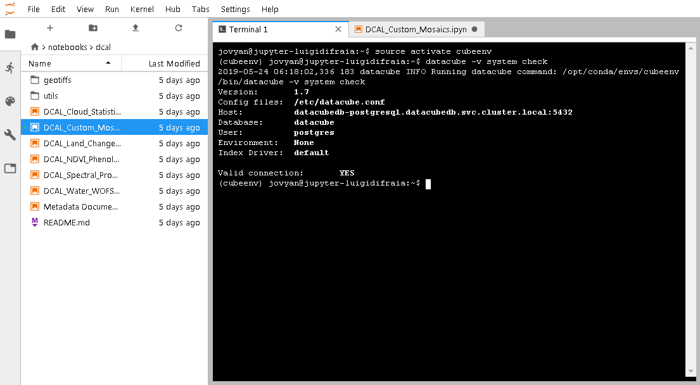
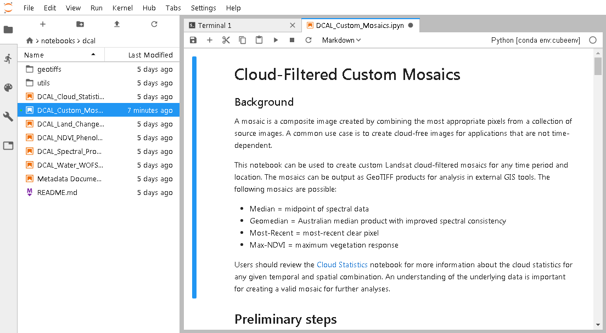
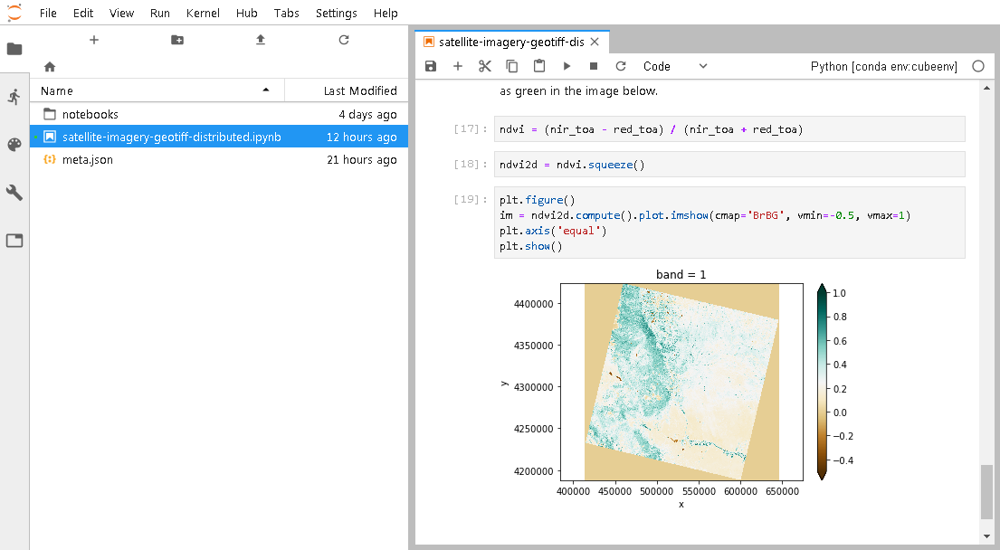
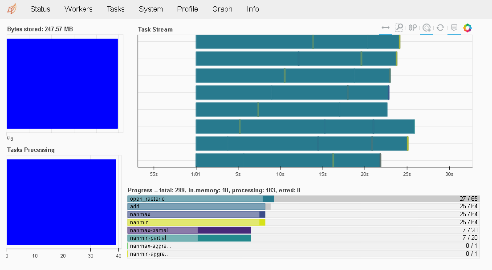

# Jupyter Notebook Open Data Cube Stack

Alpha version of an [Open Data Cube](https://www.opendatacube.org/) Jupyter Notebook Stack for [Zero to JupyterHub with Kubernetes](https://zero-to-jupyterhub.readthedocs.io/en/latest/), that is meant to let users make JupyterHub available to a large group of users, such as the staff and students of a university.

Please visit the [official documentation](https://zero-to-jupyterhub.readthedocs.io/en/latest/user-environment.html#customize-an-existing-docker-image) for Zero to JupyterHub with Kubernetes if you need help using and contributing to this repo.

## Building the Docker image

For most users pre-built Docker images will work just fine. These can be conveniently pulled from [Docker Hub](https://hub.docker.com/r/luigidifraia/datacube-notebook).

A custom Docker image for Open Data Cube can be built from this repo as per below:

`docker build -t datacube-notebook .`

Should dependencies break over time, a Miniconda [environment.yml](environment.yml) was provided to replicate the Docker image build at the time a release was created.

## Deployment

It's necessary to create a *config.yaml* file specific to the Kubernetes cluster where [JupyterHub](https://jupyter.org/hub) is being deployed. For help doing so, please visit the documentation reference [here](https://zero-to-jupyterhub.readthedocs.io/en/latest/setup-jupyterhub.html) and [here](https://zero-to-jupyterhub.readthedocs.io/en/latest/reference.html#helm-chart-configuration-reference). The [config.yaml.example](examples/configuration/config.yaml.example) file can be used as a quick-reference guide.

Once a *config.yaml* file is put together, the deployment of JupyterHub can be started with:

```
RELEASE=jhub
NAMESPACE=jhub

helm upgrade --install $RELEASE jupyterhub/jupyterhub \
  --namespace $NAMESPACE \
  --version=0.8.2 \
  --values config.yaml
```

The underlying database required by the Open Data Cube can be set up by means of the official [Helm chart for PostgreSQL](https://github.com/helm/charts/tree/master/stable/postgresql). For this purpose, a *config-postgresql.yaml* file has to be created. The [config-postgresql.yaml.example](examples/configuration/config-postgresql.yaml.example) file can be used as a quick-reference guide.

Once a *config-postgresql.yaml* file is put together, the deployment of the PostgreSQL database can be started with:

```
RELEASEDB=datacubedb
NAMESPACEDB=datacubedb

helm upgrade --install $RELEASEDB stable/postgresql \
  --namespace $NAMESPACEDB \
  --version 3.17.0 \
  --values config-postgresql.yaml
```

It is also necessary to create a corresponding configuration file *datacube-conf.yaml* that is mounted as */etc/datacube.conf* through a ConfigMap named `datacube-conf`. The [datacube-conf.yaml.example](examples/configuration/datacube-conf.yaml.example) file can be used as a quick-reference guide.

Once a *datacube-conf.yaml* file is put together, the corresponding ConfigMap can be set up with:

`kubectl apply -f datacube-conf.yaml`

The resulting environment will look like the following one:


JupyterLab is enabled by default in the [config.yaml.example](examples/configuration/config.yaml.example) provided.


After launching a Terminal, the Open Data Cube DB can be initialised with:

```
source activate cubeenv
datacube -v system init
```

Afterwards, its status can be checked with:

```
source activate cubeenv
datacube -v system check
```



When using Jupyter Notebook make sure the *cubeenv* kernel is selected:



## WIP: Horizontal scaling with Dask

An experimental integration for [Dask](https://dask.org/) is being worked at. To try it out, a *config-dask.yaml* file has to be created. The [config-dask.yaml.example](examples/configuration/config-dask.yaml.example) file can be used as a quick-reference guide.

Once a *config-dask.yaml* file is put together, the deployment of the [Dask cluster](https://github.com/helm/charts/tree/master/stable/dask) can be started with:

```
RELEASEDASK=dask
NAMESPACEDASK=dask

helm upgrade --install $RELEASEDASK stable/dask \
  --namespace $NAMESPACEDASK \
  --version=2.2.0 \
  --values config-dask.yaml
```

From within a Jupyter Notebook a Dask distributed client can then be instantiated with:

```
import dask
from dask.distributed import Client
client = Client('dask-scheduler.dask.svc.cluster.local:8786')
client
```

### Ingress for Dask's Dashboard

To access Dask's [Dashboard](http://docs.dask.org/en/latest/diagnostics-distributed.html#dashboard) an *Ingress* might have to be deployed (e.g. if not using a public cloud's load balancer), using a *dask-webui-ingress.yaml* file. The [dask-webui-ingress.yaml.example](examples/configuration/dask-webui-ingress.yaml.example) file can be used as a quick-reference guide.

Once a *dask-webui-ingress.yaml* is put together, the deployment of an *Ingress* can be started with:

`kubectl apply -f dask-webui-ingress.yaml`

### Sample Notebook for Dask's distributed computing

A sample Notebook is provided to validate the setup of the Dask cluster, [satellite-imagery-geotiff-distributed.ipynb](examples/notebooks/dask/satellite-imagery-geotiff-distributed.ipynb). Such Notebook is based on the one provided within Dask's GitHub repo [here](https://github.com/dask/dask-examples/blob/master/applications/satellite-imagery-geotiff.ipynb).

Here's a screenshot from the Notebook itself:



And here's a screenshot from Dask's Dashboard during the Max/Min calculation:



## Revision control!

Readers would have noticed that the above setup instructions insist on the creation of YAML files. The reason for creating YAML files, rather than e.g. passing values to the Helm client using the `--set` option, is that such files should be put under revision control, so that they can be used to reproduce a working setup programmatically.

## Cleaning up

If you wish to undo changes to your Kubernetes cluster, simply issue the following commands:

```
helm delete $RELEASE --purge
kubectl delete -f datacube-conf.yaml
kubectl delete namespace $NAMESPACE

helm delete $RELEASEDB --purge
kubectl delete namespace $NAMESPACEDB

helm delete $RELEASEDASK --purge
kubectl delete -f dask-webui-ingress.yaml
kubectl delete namespace $NAMESPACEDASK
```

## TODO

A few things need to be finished and/or added, in particular:
- Persistence of user data, including Jupyter Notebooks, possibly with an example that uses a shared [PV](https://zero-to-jupyterhub.readthedocs.io/en/latest/user-storage.html#additional-storage-volumes)
- ~~Use of a ConfigMap for `.datacube.conf`~~
- Disable the LoadBalancer service when an Ingress is used instead (service/proxy-public)
- Explore *cert-manager* for secure connections with certificate auto-renewal
- Automatic Open Data Cube DB initialization and sample product indexing (this is a one-off operation that requires documenting and possibly making configuration files/prepare scripts available in the Docker image)
- Production-ready configuration example for PostgreSQL, including persistence/replication
- Dask workers should really run code in a virtual environment, set up consistently with the one the datacube core runs in (at the moment Dask workers run Python 3.7)
- Explore [Dask Kubernetes](http://kubernetes.dask.org/en/latest/)
- Production-ready configuration example for a Dask cluster to scale horizontally
- Example EO Notebooks, especially *mean value* calculations that leverage Dask

## Known issues

- ~~Using default ingress settings, a "413 Request Entity Too Large" error occurs when trying to save large Notebooks~~
