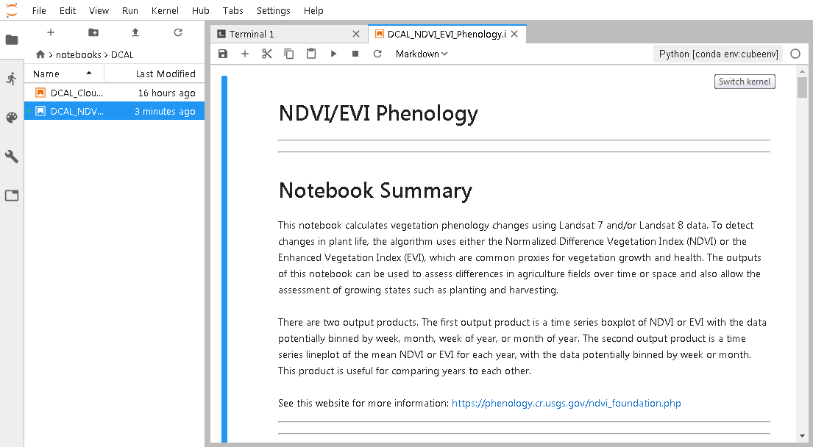

# Jupyter Notebook Open Data Cube Stack

[Open Data Cube](https://www.opendatacube.org/) Jupyter Notebook Stack. Please visit the [documentation site](https://zero-to-jupyterhub.readthedocs.io/en/latest/user-environment.html#customize-an-existing-docker-image) for help using and contributing to this repo.

## Building

Pre-built images can be pulled from [Docker Hub](https://hub.docker.com/r/luigidifraia/datacube-notebook).

A custom Docker image for Open Data Cube can be built from this repo as per below:

`docker build -t datacube-notebook .`

Should dependencies break over time, a Miniconda [environment.yml.example](environment.yml.example) was provided to replicate the Docker image build at the time this repo was created.

## Testing/Development set-up

For deployment purposes it's necessary to create a *config.yaml* file specific to the Kubernetes cluster where [JupyterHub](https://jupyter.org/hub) is being deployed. For help doing so, please visit the [documentation reference](https://zero-to-jupyterhub.readthedocs.io/en/latest/reference.html#helm-chart-configuration-reference).\
You can use the [config.yaml.example](config.yaml.example) file as a quick reference for testing purposes.

Once done, you might want to start the JupyterHub deployment with:

```
RELEASE=jhub
NAMESPACE=jhub

helm upgrade --install $RELEASE jupyterhub/jupyterhub \
  --namespace $NAMESPACE \
  --version=0.8.2 \
  --values config.yaml
```

For testing purposes the underlying database required by the Open Data Cube can be set up by means of the official [Helm chart for PostgreSQL](https://github.com/helm/charts/tree/master/stable/postgresql) as follows (make sure the PV claim can be satisfied for data persistence, otherwise **for testing purposes only** add the option `persistence.enabled=false`):

```
RELEASEDB=datacubedb
NAMESPACEDB=datacubedb

helm upgrade --install $RELEASEDB stable/postgresql \
  --namespace $NAMESPACEDB \
  --set postgresqlPassword=localuser1234,postgresqlDatabase=datacube
```

The corresponding test configuration, `/home/jovyan/.datacube.conf`, would then look as per below:

```
[datacube]
db_database: datacube

# A blank host will use a local socket. Specify a hostname (such as localhost) to use TCP.
db_hostname: datacubedb-postgresql.datacubedb.svc.cluster.local

# Credentials are optional: you might have other Postgres authentication configured.
# The default username is the current user id
db_username: postgres

# A blank password will fall back to default postgres driver authentication, such as reading your ~/.pgpass file.
db_password: localuser1234
```

The resulting environment will look like the following one:


JupyterLab is enabled by default in the [config.yaml.example](config.yaml.example) provided. Therefore, after launching a Terminal, you can initialize the Open Data Cube DB with:

```
source activate cubeenv
datacube -v system init
```

Afterwards, you can check the Cube status with:

```
source activate cubeenv
datacube -v system check
```


When using Jupyter Notebook make sure you select the *cubeenv* kernel:



## WIP

### Horizontal scaling with Dask

An experimental integration for [Dask](https://dask.org/) is being worked at. To try it, simply create a *config-dask.yaml* file using the [config-dask.yaml.example](config-dask.yaml.example) provided. At that point, you might want to start the [Dask cluster](https://github.com/helm/charts/tree/master/stable/dask) deployment with:

```
RELEASEDASK=dask
NAMESPACEDASK=dask

helm upgrade --install $RELEASEDASK stable/dask \
  --namespace $NAMESPACEDASK \
  --values config-dask.yaml
```

From within a Notebook you can then instantiate a Dask distributed client with:

```
import dask
from dask.distributed import Client
client = Client('dask-scheduler.dask.svc.cluster.local:8786')
client
```

To access Dask's [Dashboard](http://docs.dask.org/en/latest/diagnostics-distributed.html#dashboard) you might want to deploy an *Ingress*, using the [dask-webui-ingress.yaml.example](dask-webui-ingress.yaml.example) file as a quick reference:

`kubectl apply -f dask-webui-ingress.yaml`

## TODO

A few things need to be finished and/or added, in particular:
- Persistence of user data, including Jupyter Notebooks
- Use of a ConfigMap for `.datacube.conf`
- Disable the LoadBalancer service when an Ingress is used instead (service/proxy-public)
- Explore *cert-manager* for secure connections with certificate auto-renewal
- Automatic Open Data Cube DB initialization and sample product indexing (this is a one-off operation that requires documenting and possibly making configuration files/prepare scripts available in the Docker image)
- Workaround for `nbgitpuller` to pull external references too, e.g. the utils folder under [data_cube_notebooks](https://github.com/ceos-seo/data_cube_notebooks)
- Production-ready configuration example for PostgreSQL, including persistence/replication
- Explore [Dask Kubernetes](http://kubernetes.dask.org/en/latest/)
- Production-ready configuration example for a Dask cluster to scale horizontally
- Example EO Notebooks, especially *mean value* calculations that leverage Dask
